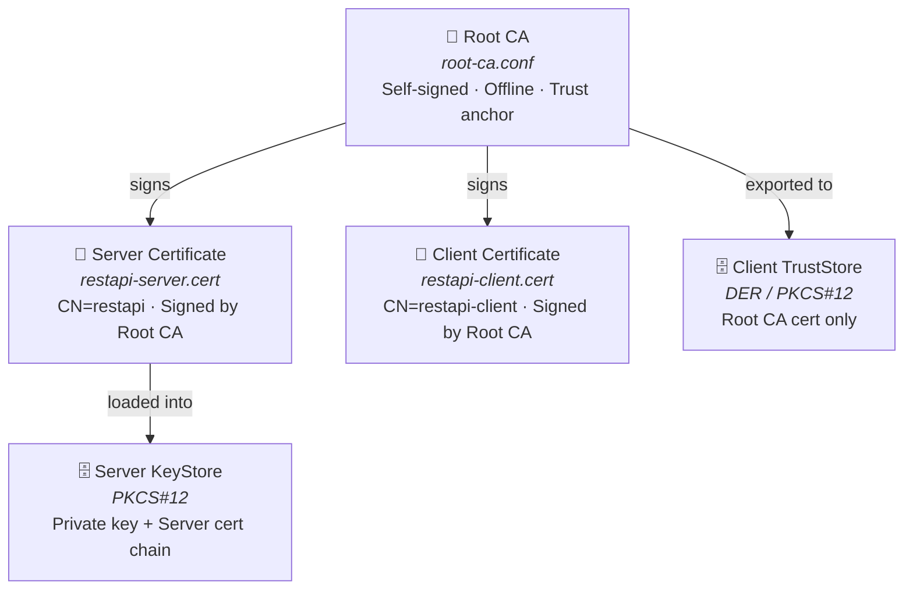
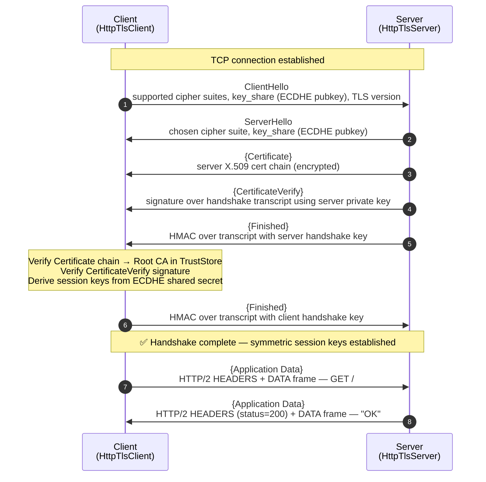
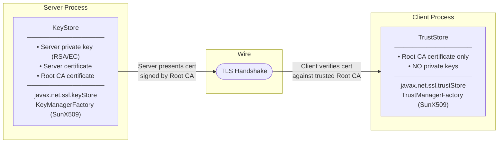
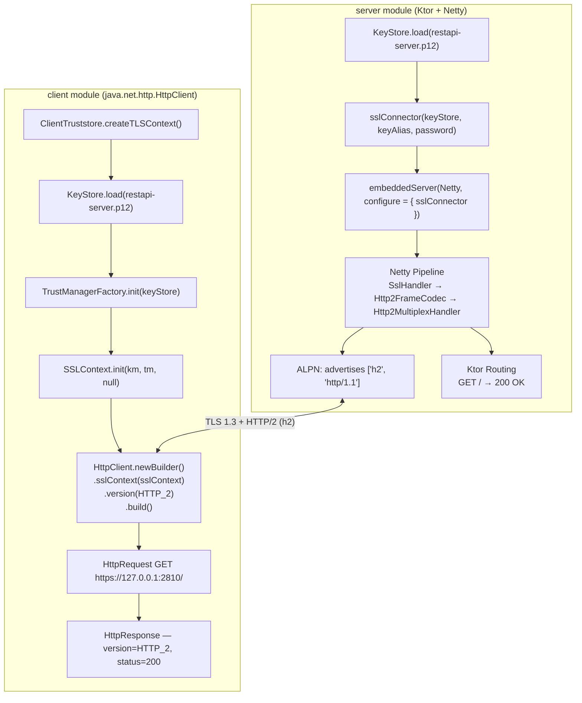
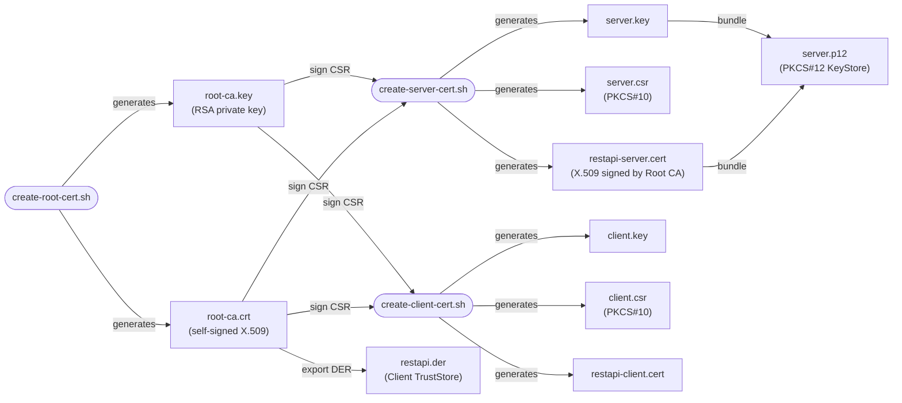

# TLS Mutual Authentication — Kotlin Reference Implementation

A production-grade demonstration of TLS 1.3 server–client communication using asymmetric cryptography, X.509 certificate chains, and the Java Secure Socket Extension (JSSE) stack, implemented in Kotlin 2.x.

---

## Table of Contents

1. [Cryptographic Foundations](#1-cryptographic-foundations)
2. [Certificate Hierarchy](#2-certificate-hierarchy)
3. [TLS Handshake — Full Protocol Flow](#3-tls-handshake--full-protocol-flow)
4. [KeyStore vs TrustStore](#4-keystore-vs-truststore)
5. [JSSE Architecture in this Codebase](#5-jsse-architecture-in-this-codebase)
6. [Certificate Provisioning Pipeline](#6-certificate-provisioning-pipeline)
7. [Threat Model & Security Properties](#7-threat-model--security-properties)
8. [Project Structure](#8-project-structure)
9. [Running Locally](#9-running-locally)

---

## 1. Cryptographic Foundations

TLS security rests on **asymmetric (public-key) cryptography**. A key pair has one irreducible property:

> Data encrypted with the **public key** can _only_ be decrypted with the corresponding **private key**, and vice versa.

This asymmetry enables two independent security goals over the same key pair:

| Goal | Operation | Who holds the key |
|---|---|---|
| **Confidentiality** | Encrypt with server's public key | Client encrypts → Server decrypts |
| **Authentication** | Sign with private key, verify with public key | Server signs → Client verifies |

In TLS 1.3 the asymmetric keys are used exclusively for **authentication and key exchange** (via ECDHE). Bulk data is always encrypted with a symmetric session key derived during the handshake, keeping latency minimal.

---

## 2. Certificate Hierarchy

This repo uses a three-tier PKI matching production CA structures:



The Root CA **never** appears on the wire. It is the offline trust anchor whose public key, embedded in the client's TrustStore, allows the client to verify the server's certificate without any prior connection.

---

## 3. TLS Handshake — Full Protocol Flow

TLS 1.3 collapses the classic 2-RTT handshake of TLS 1.2 into **1-RTT** (0-RTT for session resumption).



**Key derivation (HKDF chain):**

$$
\text{SharedSecret} \xrightarrow{\text{HKDF-Extract}} \text{HandshakeSecret} \xrightarrow{\text{HKDF-Expand}} \begin{cases} \text{client\_handshake\_key} \\ \text{server\_handshake\_key} \\ \text{client\_application\_key} \\ \text{server\_application\_key} \end{cases}
$$

Each direction uses an independent key — compromise of one does not expose the other (forward secrecy via ephemeral ECDHE).

---

## 4. KeyStore vs TrustStore

Both are `java.security.KeyStore` instances at the JVM level. The distinction is **semantic and role-based**:



| Property | KeyStore | TrustStore |
|---|---|---|
| Contains private keys | ✅ Yes | ❌ Never |
| Contains certificates | ✅ Own cert + chain | ✅ Trusted CA certs |
| Protects | Server identity / decryption | Client's list of trusted issuers |
| Exposed on wire | Certificate (public) only | Never sent |
| JVM property | `javax.net.ssl.keyStore` | `javax.net.ssl.trustStore` |
| Factory | `KeyManagerFactory` | `TrustManagerFactory` |
| Format in this repo | PKCS#12 (`.p12`) | DER (`.der`) / PKCS#12 |

---

## 5. Architecture in this Codebase



**Key design points:**
- The server's `KeyStore` (PKCS#12) is loaded directly into Ktor's `sslConnector` — no manual `SSLContext` wiring needed on the server side; Netty owns the TLS pipeline.
- The client's `SSLContext` is built from the same PKCS#12 (acting as TrustStore) and injected into `java.net.http.HttpClient` — zero new dependencies on the client side.
- HTTP/2 is negotiated via **ALPN** during the TLS handshake; neither side needs any post-handshake protocol switching.

---

## 6. Certificate Provisioning Pipeline

Certificates are generated via shell scripts in `server/conf3/`. The chain mirrors a real CA workflow:



**PKCS#10 (CSR)** is the standard wire format for certificate signing requests — it contains the subject's public key and Distinguished Name, signed by the subject's private key to prove key possession, but carries no trust itself until a CA signs it into an X.509 certificate.

---

## 7. Threat Model & Security Properties

| Property | Mechanism | Status in this repo |
|---|---|---|
| **Confidentiality** | AES-GCM session key derived via ECDHE | ✅ Enforced by TLS 1.3 |
| **Server Authentication** | Client verifies server cert chain to Root CA in TrustStore | ✅ `TrustManagerFactory` in `ClientTruststore` |
| **Client Authentication (mTLS)** | Server verifies client cert via `needClientAuth` | ⚠️ Not enabled — Ktor/Netty accepts any client |
| **Forward Secrecy** | Ephemeral ECDHE key exchange — session keys not derivable from long-term keys | ✅ TLS 1.3 mandatory |
| **Replay Protection** | Sequence numbers in TLS Record Layer + session tickets with age limit | ✅ Enforced by TLS |
| **Cipher Suite Negotiation** | Netty pins to TLS 1.3 suites via `SslContextBuilder` | ✅ Only `TLS_AES_256_GCM_SHA384`, `TLS_CHACHA20_POLY1305_SHA256`, `TLS_AES_128_GCM_SHA256` |
| **Certificate Revocation** | OCSP / CRL | ❌ Not implemented |
| **Private Key Protection** | PKCS#12 password-encrypted at rest | ✅ Password required to load |
| **SAN Hostname Verification** | `java.net.http.HttpClient` enforces SAN matching (CN ignored per RFC 6125) | ✅ Cert includes `DNS:localhost`, `IP:127.0.0.1` |

**To enable mTLS**, configure Ktor's `sslConnector`:
```kotlin
sslConnector(...) {
    this.port = ...
    // require and verify client certificate
    clientAuth = ClientAuth.REQUIRE
}
```
The server's KeyStore must also contain the Root CA that signed the client certificate.

---

## 8. Project Structure

```
tls.kotlin/
├── .vscode/settings.json                     # No wildcard imports, organise on save
├── .sdkmanrc                                 # Pins java=21.0.2-tem
├── build.gradle                              # Root — runServer / runClient convenience tasks
├── settings.gradle                           # Multi-project: includes 'server', 'client'
├── gradlew / gradlew.bat                     # Gradle 9.4.1 wrapper
├── docs/
│   └── http2-server-design.md               # Why the JDK has no HTTP/2 server API
├── server/
│   ├── build.gradle                          # Kotlin 2.1.21 + Ktor 3.0.3 + Netty + BouncyCastle
│   ├── conf3/
│   │   ├── root-ca.conf                      # Root CA config (basicConstraints=CA:TRUE)
│   │   ├── restapi-server.conf               # Server cert config (SAN: DNS:localhost, IP:127.0.0.1)
│   │   ├── create-root-cert.sh               # Step 1: generate Root CA (no passphrase)
│   │   ├── create-server-cert.sh             # Step 2: server cert + PKCS#12 (password: server)
│   │   ├── create-client-cert.sh             # Step 3: client cert
│   │   └── restapi-server.p12               # PKCS#12 KeyStore loaded by server at runtime
│   └── src/main/kotlin/server/api/
│       ├── Server.kt                         # Entry point — wires port/keystore/password
│       ├── HttpTlsServer.kt                  # Ktor embeddedServer(Netty) + sslConnector + routing
│       └── tls/
│           └── CertificateStore.kt           # KeyStore → KeyManagerFactory → SSLContext (unused by server, kept for reference)
├── client/
│   ├── build.gradle                          # Kotlin 2.1.21, no extra deps (HttpClient is in JDK)
│   ├── conf/
│   │   └── restapi.der                       # Root CA cert (DER) — legacy; p12 used instead
│   └── src/main/kotlin/client/api/
│       ├── Client.kt                         # Entry point — wires host/port/truststore
│       ├── HttTlsClient.kt                   # java.net.http.HttpClient HTTP/2 + custom SSLContext
│       └── tls/
│           └── ClientTruststore.kt           # KeyStore → TrustManagerFactory → SSLContext factory
```

---

## 9. Running Locally

**Prerequisites:** JDK 21+ (`sdk env` with sdkman), Gradle wrapper included (`./gradlew`)

```bash
# 1. Generate PKI artifacts (one-time)
cd server/conf3
bash create-root-cert.sh
bash create-server-cert.sh

# 2. Start the server — tab 1 (blocks, Ktor/Netty listening on :2810 over TLS)
cd /path/to/tls.kotlin
./gradlew runServer

# 3. Start the client — tab 2
./gradlew runClient
```

**Expected output (server):**
```
[INFO] HttpTlsServer HTTP/2 over TLS 1.3 started on port 2810
Application started in 0.1 seconds.
[INFO] Server received request: GET /
```

**Expected output (client):**
```
[INFO] HttpTlsClient HTTP/2 over TLS 1.3 started
[INFO] ClientConnection HTTP version  : HTTP_2
[INFO] ClientConnection status        : 200
[INFO] ClientConnection body          : OK
```

---

## References

- [RFC 8446 — TLS 1.3](https://datatracker.ietf.org/doc/html/rfc8446)
- [JSSE Reference Guide (OpenJDK 21)](https://docs.oracle.com/en/java/javase/21/security/java-secure-socket-extension-jsse-reference-guide.html)
- [X.509 Certificate Format (RFC 5280)](https://datatracker.ietf.org/doc/html/rfc5280)
- [PKCS#12 (RFC 7292)](https://datatracker.ietf.org/doc/html/rfc7292)
- [Elliptic Curve Diffie-Hellman Ephemeral (ECDHE)](https://en.wikipedia.org/wiki/Elliptic-curve_Diffie%E2%80%93Hellman)
- [HKDF — RFC 5869](https://datatracker.ietf.org/doc/html/rfc5869)

