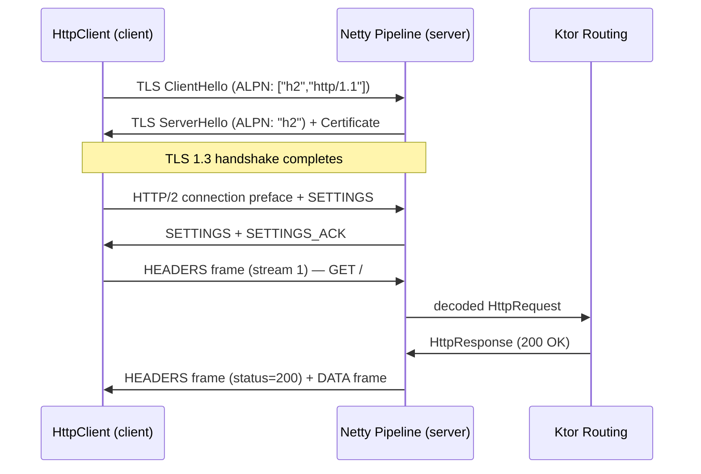

# Why Netty for HTTP/2 Server?

## The JDK has no HTTP/2 server API — in any version, including Java 25

The JDK splits HTTP/2 support asymmetrically:

| | Client | Server |
|---|---|---|
| **HTTP/1.1** | `java.net.HttpURLConnection` | `com.sun.net.httpserver.HttpsServer` (added JDK 18, [JEP 408](https://openjdk.org/jeps/408)) |
| **HTTP/2** | `java.net.http.HttpClient` (Java 11+, [JEP 110](https://openjdk.org/jeps/110)) | ❌ Not in the JDK — in any version |

[JEP 408 (Java 18)](https://openjdk.org/jeps/408) added a simple HTTP server to the JDK but it is **HTTP/1.1 only**. There is no planned JEP for an HTTP/2 server in the JDK.

---

## Why HTTP/2 server is non-trivial

An HTTP/2 server is not just "HTTP/1.1 with a version header change". It requires a full protocol stack:

### 1. ALPN negotiation (TLS layer)
During the TLS handshake, the server must advertise `["h2", "http/1.1"]` via the
**Application-Layer Protocol Negotiation** TLS extension (RFC 7301). The client selects `h2` and
both sides commit to HTTP/2 framing before the first byte of application data is sent.

The JDK's `SSLServerSocket` supports ALPN parameter setting since Java 9, but it only handles the
negotiation signal — it does not know how to speak HTTP/2 frames.

```
TLS ClientHello  →  ALPN extension: ["h2", "http/1.1"]
TLS ServerHello  ←  ALPN extension: "h2"            ← server commits here
             [ TLS handshake completes ]
HTTP/2 client connection preface  →  PRI * HTTP/2.0\r\n\r\nSM\r\n\r\n
HTTP/2 SETTINGS frame  ←
```

### 2. Binary frame parsing (RFC 9113)
HTTP/2 replaces HTTP/1.1 text lines with a **binary framing layer**. Every message is a frame:

```
+-----------------------------------------------+
|                 Length (24)                   |
+---------------+---------------+---------------+
|   Type (8)    |   Flags (8)   |
+-+-------------+---------------+-------------------------------+
|R|                 Stream Identifier (31)                     |
+=+=============================================================+
|                   Frame Payload (0...)                        |
+---------------------------------------------------------------+
```

Frame types include `HEADERS`, `DATA`, `SETTINGS`, `WINDOW_UPDATE`, `PING`, `GOAWAY`, etc.
A raw `SSLSocket` gives you a byte stream — you would have to implement all of RFC 9113 yourself.

### 3. Stream multiplexing
Multiple logical request/response pairs share a **single TCP connection** via stream IDs.
The server must maintain a stream state machine per connection, handle flow control windows
(`WINDOW_UPDATE`), and correctly interleave frame writes across concurrent streams.

### 4. HPACK header compression (RFC 7541)
HTTP/2 compresses headers using a static table (61 predefined entries) and a dynamic table
maintained per-connection. Both sides must keep their dynamic tables in sync. A mismatch causes
`COMPRESSION_ERROR` and tears down the connection.

---

## Why a library is required

These four concerns together — ALPN wiring, binary frame codec, stream multiplexer, HPACK —
amount to roughly the complexity of a full TCP/IP stack implementation. No JDK version provides
them on the server side.

### Options, in order of abstraction

| Option | Key dependencies | Notes |
|---|---|---|
| **Ktor + Netty** ← current | `ktor-server-netty` | Ktor routing DSL over Netty's HTTP/2 codec |
| **Raw Netty** | `netty-codec-http2` | Full control, more pipeline boilerplate, no Ktor overhead |
| **Jetty** | `jetty-server`, `jetty-http2-server` | Mature, lighter on memory than Netty for pure HTTP/2 |
| **Javalin** | `javalin` (wraps Jetty) | Simple routing DSL, Jetty underneath |
| **Armeria** | `armeria` | gRPC + HTTP/2 first-class, Netty underneath |

Ktor + Netty is the leanest high-level option for a Kotlin-native codebase. Netty's
`Http2FrameCodec` and `Http2MultiplexHandler` handle all four concerns above; Ktor wires ALPN
and provides the routing DSL.

---

## What Netty does under the hood in this project



**Netty pipeline stages for TLS + HTTP/2:**
```
SslHandler                    ← TLS 1.3 record layer, ALPN negotiation
  └─ Http2FrameCodec          ← binary frame encode/decode, SETTINGS, PING, flow control
       └─ Http2MultiplexHandler  ← per-stream channels
            └─ KtorHttpHandler  ← Ktor application call dispatch
```

---

## References

- [RFC 9113 — HTTP/2](https://datatracker.ietf.org/doc/html/rfc9113)
- [RFC 7541 — HPACK Header Compression](https://datatracker.ietf.org/doc/html/rfc7541)
- [RFC 7301 — TLS ALPN Extension](https://datatracker.ietf.org/doc/html/rfc7301)
- [JEP 110 — HTTP/2 Client (Java 9)](https://openjdk.org/jeps/110)
- [JEP 408 — Simple Web Server (Java 18, HTTP/1.1 only)](https://openjdk.org/jeps/408)
- [Netty HTTP/2 codec](https://netty.io/4.1/api/io/netty/handler/codec/http2/package-summary.html)
- [Ktor server engines](https://ktor.io/docs/server-engines.html)
